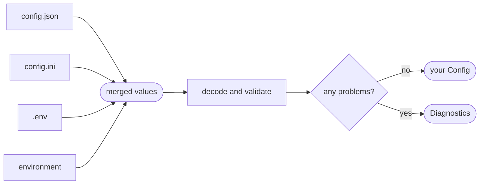

# confy

**Typed configuration for Zig.** Declare a struct, list where the values come
from — JSON and INI files, `.env` files, environment variables — and confy fills
the struct, checks every value against its field's type, and reports every
problem at once, each pointing at the file and line it came from.

```zig
const Config = struct {
    log_level: enum { debug, info, warn, err } = .info,
    http: struct {
        port: u16 = 8080,
    },
    db: struct {
        url: []const u8,
        password: confy.Secret,
    },
};

var config: Config = undefined;
confy.loadOrExit(init.arena.allocator(), &config, .{
    .io = init.io,
    .environ = init.environ_map,
    .env_prefix = "APP_",
    .sources = &.{ .json("config.json"), .env(".env"), .osEnv() },
});
```

## Contents

- [How it works](#how-it-works)
- [Installation](#installation)
- [Getting started](#getting-started)
- [The configuration struct](#the-configuration-struct)
- [Field types](#field-types)
- [Keys and variable names](#keys-and-variable-names)
- [Sources](#sources)
- [Loading](#loading)
- [Validation](#validation)
- [Problems and diagnostics](#problems-and-diagnostics)
- [Secrets](#secrets)
- [Testing](#testing)
- [Limits](#limits)

Guides for each source: [JSON](json.md) · [INI](ini.md) · [.env](dotenv.md) ·
[Environment](env.md) · [Several sources](several_sources.md)

## How it works



1. **Read.** Each source is read in the order you list it. Files are parsed into
   a tree of values. Environment variables are looked up by the names of your
   fields and placed into the same tree.
2. **Merge.** A later source overrides an earlier one. Objects merge key by
   key; everything else, lists included, is replaced.
3. **Decode.** Every field of your struct is looked up by its path and parsed
   into its type. Fields that no source sets get their defaults.
4. **Validate.** Each struct that declares `pub fn validate` checks its own rules.
5. **Report.** If anything went wrong — a missing file, a syntax error, an
   unknown key, a value that doesn't fit — you get all the problems together.

## Installation

Add zefir to your `build.zig.zon`:

```sh
zig fetch --save git+https://github.com/vkiryakov/zefir#<ref>
```

Then import the `zefir-confy` module in `build.zig`:

```zig
const zefir = b.dependency("zefir", .{
    .target = target,
    .optimize = optimize,
});

const exe = b.addExecutable(.{
    .name = "app",
    .root_module = b.createModule(.{
        .root_source_file = b.path("src/main.zig"),
        .target = target,
        .optimize = optimize,
        .imports = &.{
            .{ .name = "confy", .module = zefir.module("zefir-confy") },
        },
    }),
});
```

> [!TIP]
> confy is also part of the umbrella module: with `zefir.module("zefir")`
> imported as `zefir`, it is `@import("zefir").confy`. Both are the same module.

## Getting started

Put the defaults in a file next to your program, the password in `.env`:

**`config.json`**

```json
{
  "http": { "port": 8080 },
  "db": { "url": "postgres://localhost:5432/app" }
}
```

**`.env`**

```sh
APP_DB_PASSWORD=change-me
```

Declare the configuration and load it at the start of `main`:

**`src/main.zig`**

```zig
const std = @import("std");
const confy = @import("confy");

const Config = struct {
    log_level: enum { debug, info, warn, err } = .info,
    http: struct {
        port: u16,
        timeout_s: u32 = 30,
    },
    db: struct {
        url: []const u8,
        password: confy.Secret,
    },
};

pub fn main(init: std.process.Init) !void {
    var config: Config = undefined;
    confy.loadOrExit(init.arena.allocator(), &config, .{
        .io = init.io,
        .environ = init.environ_map,
        .env_prefix = "APP_",
        .sources = &.{ .json("config.json"), .env(".env"), .osEnv() },
    });

    std.log.info("listening on port {d}, database {s}", .{ config.http.port, config.db.url });
}
```

```text
$ zig build run
info: listening on port 8080, database postgres://localhost:5432/app
```

The environment comes last, so it overrides the files:

```text
$ APP_HTTP_PORT=9090 zig build run
info: listening on port 9090, database postgres://localhost:5432/app
```

A value that doesn't fit its field stops the program before it does anything:

```text
$ APP_HTTP_PORT=90000 zig build run
error(confy): 1 configuration problem:
  environment: APP_HTTP_PORT: invalid (expected an integer 0..65535)
```

## The configuration struct

The struct is the schema. confy reads it at compile time: each field is a key
to look for, and its type says how the value is parsed and checked.

### Required fields

A field without a default must be set by some source:

```zig
db: struct {
    url: []const u8,
},
```

When none does, loading fails, and the problem says where the value can go —
only the kinds of sources you actually use are mentioned:

```text
db.url: missing (set APP_DB_URL, or "db.url" in a config file)
```

### Defaults

A default is used when no source sets the field:

```zig
http: struct {
    port: u16 = 8080,
    timeout_s: u32 = 30,
},
```

### Optional fields

An optional field is `null` when no source sets it:

```zig
db: struct {
    replica_url: ?[]const u8,
},
```

An optional can have a default as well; then `null` means "use the default":

```zig
timeout_s: ?u32 = 30,
```

### Nested structs

Nested structs group settings. Each one is a JSON object, an INI section and a
prefix for variable names:

```zig
const Config = struct {
    db: struct {
        url: []const u8,
        pool: struct {
            size: u8 = 4,
            max_idle: u8 = 2,
        },
    },
};
```

| Field          | JSON                                | INI                                          | Variable           |
| -------------- | ----------------------------------- | -------------------------------------------- | ------------------ |
| `db.url`       | `"db": { "url": ... }`              | `url` in `[db]`                              | `APP_DB_URL`       |
| `db.pool.size` | `"db": { "pool": { "size": ... } }` | `size` in `[db.pool]`, `pool.size` in `[db]` | `APP_DB_POOL_SIZE` |

Named struct types work the same way:

```zig
const Pool = struct { size: u8 = 4, max_idle: u8 = 2 };
const Db = struct { url: []const u8, pool: Pool = .{} };
const Config = struct { db: Db };
```

A nested struct needs no source at all when every field in it has a default.
When the struct field itself has a default, that default fills the keys no
source sets — ahead of the defaults declared in the type:

```zig
const Config = struct {
    // A source that sets only db.pool.size keeps max_idle = 8 from here.
    db: struct { pool: Pool = .{ .size = 16, .max_idle = 8 } },
};
```

### Optional sections

An optional struct is `null` until some source sets one of its fields. From
then on, its required fields must be set too:

```zig
tls: ?struct {
    cert: []const u8,
    key: []const u8,
},
```

| Sources set              | Result                            |
| ------------------------ | --------------------------------- |
| nothing under `tls`      | `tls == null`                     |
| `tls.cert` and `tls.key` | `tls.?.cert`, `tls.?.key`         |
| only `tls.cert`          | problem: `tls.key: missing (...)` |

### Lists

A slice is a list. JSON writes it as an array; every other source as
comma-separated text:

```zig
http: struct {
    allowed_origins: []const []const u8 = &.{},
},
ports: []const u16 = &.{ 80, 443 },
```

```json
{ "http": { "allowed_origins": ["https://a.com", "https://b.com"] } }
```

```sh
APP_HTTP_ALLOWED_ORIGINS=https://a.com, https://b.com
```

A list of structs can only come from JSON:

```zig
upstreams: []const struct {
    host: []const u8,
    weight: u8 = 1,
} = &.{},
```

> [!NOTE]
> A list is always replaced as a whole. A later source with
> `APP_PORTS=8080` turns `[80, 443]` into `[8080]`, not `[80, 443, 8080]`.

### Enums

An enum is written as one of its tag names, with the same case:

```zig
log_level: enum { debug, info, warn, err } = .info,
```

`"warn"` gives `.warn`. `"WARN"` and `"warning"` are problems that list the
valid names: `log_level: invalid (expected one of: debug, info, warn, err)`.

## Field types

| Field type                            | JSON                       | INI, `.env`, environment                                  |
| ------------------------------------- | -------------------------- | --------------------------------------------------------- |
| `[]const u8`                          | `"text"`                   | `text`                                                    |
| `bool`                                | `true`, `false`            | `true`/`false`, `yes`/`no`, `on`/`off`, `1`/`0`, any case |
| `u8` … `u128`, `i8` … `i128`, `usize` | `8080`, `-3`               | `8080`, `-3`                                              |
| `f32`, `f64`                          | `2.5`, `30`, `1e-3`        | `2.5`, `30`, `1e-3`                                       |
| `enum { ... }`                        | `"warn"`                   | `warn`                                                    |
| `confy.Secret`                        | `"text"`                   | `text`                                                    |
| `[]const T`                           | `[1, 2]`                   | `1, 2`                                                    |
| `[]const struct { ... }`              | `[{ ... }, { ... }]`       | not supported                                             |
| `struct { ... }`                      | `{ ... }`                  | a section, or one variable per field                      |
| `?T`                                  | a value for `T`, or `null` | a value for `T`, or nothing                               |

- An integer must fit its type: `70000` in a `u16` and `-1` in a `u8` are
  problems that state the range.
- JSON also accepts strings where numbers, bools and enums are expected:
  `"port": "8080"` works.
- Any other field type — pointers, arrays, unions — is a compile error:

  ```text
  error: confy: fields of type [4]u8 are not supported; use bool, an integer, a float, an enum, []const u8, confy.Secret, a []const slice of these, a struct, or an optional of any of them
  ```

## Keys and variable names

A field's path is its chain of names from the top: `db.pool.size`. Each source
spells the path its own way:

| Field path          | JSON                           | INI                                             | `.env` and environment |
| ------------------- | ------------------------------ | ----------------------------------------------- | ---------------------- |
| `port`              | `"port"`                       | `port`, before any section                      | `APP_PORT`             |
| `http.port`         | `"port"` in `"http"`           | `port` in `[http]`                              | `APP_HTTP_PORT`        |
| `db.pool.size`      | `"size"` in `"pool"` in `"db"` | `size` in `[db.pool]`, or `pool.size` in `[db]` | `APP_DB_POOL_SIZE`     |
| `upstreams[1].host` | `"host"` in the second item    | —                                               | —                      |

- JSON keys and INI keys are field names, exactly, including case.
- A variable name is `env_prefix`, then the field names upper-cased and joined
  with `_`. The prefix is put in front as is: `"APP_"`, not `"APP"`.
- Two fields that would get the same variable name are a compile error:

  ```zig
  const Config = struct {
      db_port: u16,
      db: struct { port: u16 },
  };
  ```

  ```text
  error: confy: fields 'db_port' and 'db.port' both map to the environment variable DB_PORT
  ```

## Sources

| Source      | Create with   | Missing file | Values | Unknown keys | Lists of structs | Guide                  |
| ----------- | ------------- | ------------ | ------ | ------------ | ---------------- | ---------------------- |
| JSON        | `.json(path)` | problem      | typed  | problem      | yes              | [json.md](json.md)     |
| INI         | `.ini(path)`  | problem      | text   | problem      | no               | [ini.md](ini.md)       |
| `.env` file | `.env(path)`  | skipped      | text   | ignored      | no               | [dotenv.md](dotenv.md) |
| Environment | `.osEnv()`    | —            | text   | ignored      | no               | [env.md](env.md)       |

Sources are listed in `Options.sources` and apply in that order; see
[several_sources.md](several_sources.md) for how they combine.

```zig
.sources = &.{
    .json("config/base.json"),
    .ini("config/production.ini"),
    .env(".env"),
    .env(".env.local"),
    .osEnv(),
},
```

## Loading

### `loadOrExit`

```zig
confy.loadOrExit(allocator, &config, options);
```

Fills `config`, or logs every problem with `std.log.err` and exits with status 1.
Use it in `main`, where a broken configuration means the program can't start.

### `load`

```zig
try confy.load(allocator, &config, options);
```

Fills `config`, or returns an error and leaves `config` untouched:

| Error                 | Meaning                                                           |
| --------------------- | ----------------------------------------------------------------- |
| `error.InvalidConfig` | the configuration has problems; they are in `options.diagnostics` |
| `error.OutOfMemory`   | an allocation failed; nothing is leaked                           |

### Options

| Option         | Type                              | Default               | Meaning                                                  |
| -------------- | --------------------------------- | --------------------- | -------------------------------------------------------- |
| `.io`          | `std.Io`                          | required              | used to read files                                       |
| `.sources`     | `[]const confy.ConfigSource`      | required              | the sources, applied in order                            |
| `.environ`     | `?*const std.process.Environ.Map` | `null`                | the variables `.osEnv()` reads; required with `.osEnv()` |
| `.env_prefix`  | `[]const u8`                      | `""`                  | put in front of every variable name                      |
| `.dir`         | `?std.Io.Dir`                     | the working directory | where relative file paths are resolved                   |
| `.diagnostics` | `?*confy.Diagnostics`             | `null`                | receives the problems when `load` fails                  |

> [!WARNING]
> With the default empty `env_prefix`, a field named `path`, `home` or `user`
> reads the system's `PATH`, `HOME` or `USER`. Give your application a prefix.

### Memory

Strings and lists in the result are allocated with the allocator you pass:

- **An arena** — `init.arena.allocator()` in `main` — releases everything with
  the arena. Nothing to free.
- **A general purpose allocator** — release the result with
  `confy.free(allocator, config)`. It overwrites every `confy.Secret` with zeros
  before freeing it.

```zig
try confy.load(gpa, &config, options);
defer confy.free(gpa, config);
```

## Validation

confy checks a lot before your code sees the configuration:

- every required field is set;
- every value parses into its field's type, and integers fit their type;
- enum values are valid tag names;
- JSON and INI files have no unknown and no repeated keys.

Rules that span several fields go into `pub fn validate`:

```zig
const Config = struct {
    db: struct {
        pool: struct { size: u8 = 4, max_idle: u8 = 2 },
    },

    pub fn validate(config: @This()) !void {
        if (config.db.pool.max_idle > config.db.pool.size) return error.MaxIdleAbovePoolSize;
    }
};
```

```text
invalid (validate() returned error.MaxIdleAbovePoolSize)
```

- confy calls `validate` once the struct's fields have loaded without problems,
  so it never sees a missing or invalid value.
- Any struct can have one, nested structs and list items included. Its problem
  starts with the struct's path: `db: invalid (validate() returned ...)`.

> [!IMPORTANT]
> `validate` must be `pub`. confy can't see a private function, and a private
> `validate` is silently never called.

## Problems and diagnostics

Every problem is a line: where the value came from, which field or variable,
what kind of problem, and what was expected.

```text
error(confy): 4 configuration problems:
  config.json:4: http.port: invalid (expected an integer 0..65535)
  .env:2: APP_DEBUG: invalid (expected true or false)
  db.url: missing (set APP_DB_URL, or "db.url" in a config file)
  config.json:2: nmae: unknown key (did you mean "name"?)
```

| Kind            | When                                                       | Example                                                            |
| --------------- | ---------------------------------------------------------- | ------------------------------------------------------------------ |
| `missing`       | a required field that no source sets                       | `db.url: missing (set APP_DB_URL)`                                 |
| `invalid`       | a value that doesn't fit its field, or a failed `validate` | `config.json:4: http.port: invalid (expected an integer 0..65535)` |
| `unknown_key`   | a JSON or INI key that matches no field                    | `config.json:2: nmae: unknown key (did you mean "name"?)`          |
| `duplicate_key` | a key or variable set twice in one file                    | `config.ini:6: http.port: duplicate key (first set on line 5)`     |
| `syntax`        | a line or file that can't be parsed                        | `.env:6: syntax error (expected KEY=value)`                        |
| `unreadable`    | a file that can't be read                                  | `config.json: cannot read file (file not found)`                   |

With `load`, pass a `confy.Diagnostics` to receive them:

```zig
var diag: confy.Diagnostics = .init(gpa);
defer diag.deinit();

confy.load(gpa, &config, .{
    .io = init.io,
    .diagnostics = &diag,
    .sources = &.{.json("config.json")},
}) catch |err| switch (err) {
    error.InvalidConfig => {
        std.debug.print("{f}\n", .{&diag}); // a header and one line per problem
        std.process.exit(1);
    },
    error.OutOfMemory => return err,
};
```

Each problem is also data:

```zig
for (diag.problems.items) |problem| {
    // problem.kind:   .missing, .invalid, .unknown_key, .duplicate_key, .syntax or .unreadable
    // problem.path:   the field, such as "db.pool.size"
    // problem.origin: the file and line, or the variable, the value came from
    // problem.detail: what was expected
    _ = problem;
}
```

> [!NOTE]
> Problems never contain values, so they are safe to log even when the wrong
> value is a password.

## Secrets

Declare passwords, tokens and keys as `confy.Secret`:

```zig
db: struct {
    password: confy.Secret,
    api_token: ?confy.Secret = null,
},
```

- `expose()` returns the value: `config.db.password.expose()`.
- `{f}` prints `[redacted]`; `{any}` shows no value; `{s}` doesn't compile.
- A secret is read from any source like a string.
- `confy.free` overwrites secrets with zeros before freeing them.

## Testing

`load` takes any directory and any variables, so a test can build its own
configuration:

```zig
test "a port out of range is reported" {
    var tmp = std.testing.tmpDir(.{});
    defer tmp.cleanup();
    try tmp.dir.writeFile(std.testing.io, .{
        .sub_path = "config.json",
        .data = "{ \"http\": { \"port\": 70000 } }",
    });

    var environ: std.process.Environ.Map = .init(std.testing.allocator);
    defer environ.deinit();
    try environ.put("APP_DB_URL", "postgres://localhost/test");
    try environ.put("APP_DB_PASSWORD", "test");

    var diag: confy.Diagnostics = .init(std.testing.allocator);
    defer diag.deinit();

    var config: Config = undefined;
    try std.testing.expectError(error.InvalidConfig, confy.load(std.testing.allocator, &config, .{
        .io = std.testing.io,
        .environ = &environ,
        .env_prefix = "APP_",
        .dir = tmp.dir,
        .diagnostics = &diag,
        .sources = &.{ .json("config.json"), .osEnv() },
    }));
    try std.testing.expectEqualStrings("http.port", diag.problems.items[0].path);
}
```

> [!TIP]
> Run `load` with `std.testing.allocator` and free the result with
> `confy.free`: the test then also checks that nothing leaks.

## Limits

| Limit                          | Value                          |
| ------------------------------ | ------------------------------ |
| File size                      | 1 MiB (`confy.max_file_bytes`) |
| JSON nesting                   | 64 levels                      |
| Variable expansion (`${HOME}`) | not supported                  |
| Multi-line values in `.env`    | not supported                  |
| Comments after an INI value    | not supported                  |
| Lists of structs outside JSON  | not supported                  |
| Misspelled variable names      | ignored, not reported          |
