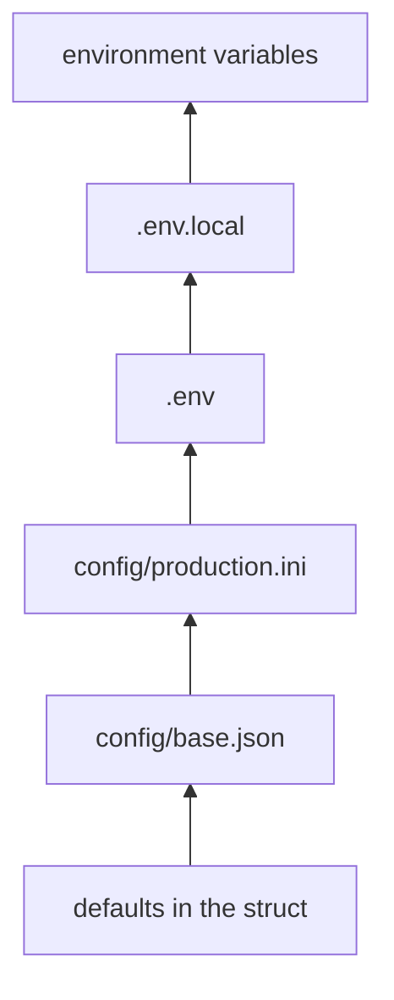

# Several sources

Real programs read their configuration from more than one place: defaults in
the repository, a file per environment, secrets kept on the machine, and the
deployment's variables on top. confy reads them all into one struct, in the
order you list them.

```zig
.sources = &.{
    .json("config/base.json"),
    .ini("config/production.ini"),
    .env(".env"),
    .env(".env.local"),
    .osEnv(),
},
```

## Contents

- [Precedence](#precedence)
- [How values combine](#how-values-combine)
- [Required and optional files](#required-and-optional-files)
- [A complete example](#a-complete-example)
- [Recipes](#recipes)
- [Problems across sources](#problems-across-sources)

## Precedence

Sources apply in the order they are listed: each one overrides the sources
before it. The defaults declared in the struct sit under all of them.



Read it from the bottom up: a value set higher wins. A field that no layer sets
keeps its default, or is reported as missing when it has none.

A field has the same path in every source, so any layer can override any
field:

| Field          | JSON                           | INI                                             | `.env` and environment |
| -------------- | ------------------------------ | ----------------------------------------------- | ---------------------- |
| `name`         | `"name"`                       | `name`, before any section                      | `APP_NAME`             |
| `http.port`    | `"port"` in `"http"`           | `port` in `[http]`                              | `APP_HTTP_PORT`        |
| `db.pool.size` | `"size"` in `"pool"` in `"db"` | `size` in `[db.pool]`, or `pool.size` in `[db]` | `APP_DB_POOL_SIZE`     |

## How values combine

### Objects merge key by key

A later source changes only the keys it sets. Everything else in the same
object keeps its earlier value:

**`config/base.json`**

```json
{ "db": { "url": "postgres://localhost:5432/app", "pool": { "size": 4 } } }
```

**`config/production.ini`**

```ini
[db.pool]
size = 16
```

| Field          | base.json                         | production.ini | Result                            |
| -------------- | --------------------------------- | -------------- | --------------------------------- |
| `db.url`       | `"postgres://localhost:5432/app"` |                | `"postgres://localhost:5432/app"` |
| `db.pool.size` | `4`                               | `16`           | `16`                              |

### Values are replaced

Strings, numbers, booleans, enums and secrets are replaced by the later source.
The new value is parsed into the field's type like any other, so a number from
JSON can be overridden by text from the environment:

| Field       | base.json | environment          | Result |
| ----------- | --------- | -------------------- | ------ |
| `http.port` | `8080`    | `APP_HTTP_PORT=9090` | `9090` |

### Lists are replaced

A list is one value: a later list replaces the earlier one as a whole. Items are
never appended:

| Field                  | base.json                   | environment                                            | Result                               |
| ---------------------- | --------------------------- | ------------------------------------------------------ | ------------------------------------ |
| `http.allowed_origins` | `["http://localhost:3000"]` | `APP_HTTP_ALLOWED_ORIGINS=https://a.com,https://b.com` | `"https://a.com"`, `"https://b.com"` |

### Null removes a value

A JSON `null` takes a key out, even when an earlier source set it. The field
falls back to its default:

| Field  | Default | config.ini    | override.json  | Result |
| ------ | ------- | ------------- | -------------- | ------ |
| `port` | `5432`  | `port = 6000` | `"port": null` | `5432` |

Use it to cancel an override from a shared file in a more specific one.

### Validation runs on the result

Types, ranges, required fields and `pub fn validate` are checked once, after
every source has been read. A required field doesn't have to be in the first
file: it only has to be set somewhere. `validate` sees the final values, not
the ones from a single file.

## Required and optional files

| Source        | When the file is missing                       |
| ------------- | ---------------------------------------------- |
| `.json(path)` | a problem: `cannot read file (file not found)` |
| `.ini(path)`  | a problem: `cannot read file (file not found)` |
| `.env(path)`  | skipped silently                               |

A missing `.env` file is normal: `.env.local` exists on one developer's machine
and nowhere else. A missing JSON or INI file usually means a wrong path, so it
stops the load.

To make a JSON or INI file optional, build the list of sources at run time:

```zig
const arena = init.arena.allocator();

var sources: std.ArrayList(confy.ConfigSource) = .empty;
try sources.append(arena, .json("config/base.json"));
if (std.Io.Dir.cwd().access(init.io, "config/local.json", .{})) {
    try sources.append(arena, .json("config/local.json"));
} else |_| {}
try sources.append(arena, .osEnv());

confy.loadOrExit(arena, &config, .{
    .io = init.io,
    .environ = init.environ_map,
    .env_prefix = "APP_",
    .sources = sources.items,
});
```

## A complete example

Settings shared by every environment, what differs in production, secrets, and
the environment on top. The files are in a `sources` directory, which `.dir`
points at.

**`sources/base.json`**

```json
{
  "name": "zefir-demo",
  "log_level": "info",
  "http": {
    "port": 8080,
    "allowed_origins": ["http://localhost:3000"]
  },
  "db": {
    "url": "postgres://localhost:5432/app",
    "pool": { "size": 4 }
  }
}
```

**`sources/production.ini`**

```ini
log_level = warn

[http]
; Not in base.json at all: it replaces the default of 30.
timeout_s = 10
; A list replaces the one in base.json; it isn't appended to it.
allowed_origins = https://app.example.com, https://admin.example.com

[db]
url = postgres://db.internal:5432/app
replica_url = postgres://replica.internal:5432/app
; Sections merge key by key: db.pool.max_idle keeps its default.
pool.size = 16
```

**`sources/.env`**

```sh
APP_DB_PASSWORD=change-me
APP_HTTP_PORT=8443
```

**`main.zig`**

```zig
const std = @import("std");
const confy = @import("confy");

const Config = struct {
    name: []const u8,
    debug: bool = false,
    log_level: enum { debug, info, warn, err } = .info,
    http: struct {
        port: u16,
        timeout_s: f32 = 30,
        allowed_origins: []const []const u8 = &.{},
    },
    db: struct {
        url: []const u8,
        password: confy.Secret,
        replica_url: ?[]const u8,
        pool: struct { size: u8 = 4, max_idle: u8 = 2 },
    },
};

pub fn main(init: std.process.Init) !void {
    const dir = try std.Io.Dir.cwd().openDir(init.io, "sources", .{});
    defer dir.close(init.io);

    var diag: confy.Diagnostics = .init(init.gpa);
    defer diag.deinit();

    var config: Config = undefined;
    confy.load(init.gpa, &config, .{
        .io = init.io,
        .environ = init.environ_map,
        .env_prefix = "APP_",
        .dir = dir,
        .diagnostics = &diag,
        .sources = &.{
            .json("base.json"),
            .ini("production.ini"),
            .env(".env"),
            .env(".env.local"),
            .osEnv(),
        },
    }) catch |err| switch (err) {
        error.InvalidConfig => {
            std.debug.print("{f}\n", .{&diag});
            std.process.exit(1);
        },
        error.OutOfMemory => return err,
    };
    defer confy.free(init.gpa, config);

    std.log.info("{s} listens on port {d}", .{ config.name, config.http.port });
}
```

| Field                  | Value                                                      | Comes from                                 |
| ---------------------- | ---------------------------------------------------------- | ------------------------------------------ |
| `name`                 | `"zefir-demo"`                                             | base.json                                  |
| `debug`                | `false`                                                    | the default                                |
| `log_level`            | `.warn`                                                    | production.ini, over base.json             |
| `http.port`            | `8443`                                                     | .env, over base.json                       |
| `http.timeout_s`       | `10`                                                       | production.ini, over the default           |
| `http.allowed_origins` | `"https://app.example.com"`, `"https://admin.example.com"` | production.ini, replacing base.json's list |
| `db.url`               | `"postgres://db.internal:5432/app"`                        | production.ini, over base.json             |
| `db.password`          | `"change-me"`                                              | .env                                       |
| `db.replica_url`       | `"postgres://replica.internal:5432/app"`                   | production.ini                             |
| `db.pool.size`         | `16`                                                       | production.ini, over base.json             |
| `db.pool.max_idle`     | `2`                                                        | the default                                |

Now play with the layers:

| You do                                           | You get                                          |
| ------------------------------------------------ | ------------------------------------------------ |
| run with `APP_HTTP_PORT=9090`                    | `http.port = 9090`: the environment beats `.env` |
| run with `APP_LOG_LEVEL=debug`                   | `log_level = .debug`: over production.ini        |
| add `APP_HTTP_PORT=7000` to `sources/.env.local` | `http.port = 7000`: `.env.local` beats `.env`    |
| both of the above                                | `http.port = 9090`: the environment still wins   |
| remove `APP_DB_PASSWORD` from `sources/.env`     | problem: `db.password: missing (...)`            |
| add `"debug": true` to `sources/base.json`       | `debug = true`                                   |

## Recipes

### Defaults in code, overrides from the environment

The twelve-factor way: every field has a default, and the deployment changes
what it needs. No files at all.

```zig
.sources = &.{.osEnv()},
```

### A file per environment

Pick the file from a variable, so one binary runs everywhere:

```zig
const arena = init.arena.allocator();
const environment = init.environ_map.get("APP_ENV") orelse "development";
const env_file = try std.fmt.allocPrint(arena, "config/{s}.ini", .{environment});

confy.loadOrExit(arena, &config, .{
    .io = init.io,
    .environ = init.environ_map,
    .env_prefix = "APP_",
    .sources = &.{ .json("config/base.json"), .ini(env_file), .env(".env"), .osEnv() },
});
```

An INI file must exist, so a typo in `APP_ENV` is caught at once:
`config/stagign.ini: cannot read file (file not found)`.

### Secrets out of the repository

Commit the files without secrets, and declare the secrets as required
`confy.Secret` fields. Locally they come from `.env` (in `.gitignore`); in
production, from the environment — for example from a Kubernetes secret (see
[env.md](env.md#kubernetes)). A machine where nobody set them fails to start with
`db.password: missing (set APP_DB_PASSWORD, ...)` instead of running without a
password.

### Personal overrides

List `.env.local` after `.env` and put it in `.gitignore`. Each developer keeps
their own ports and database there, and nothing changes for anyone else.

```zig
.sources = &.{ .json("config.json"), .env(".env"), .env(".env.local"), .osEnv() },
```

### Lists of structs with overrides

Only JSON can hold a list of structs, and a list is replaced as a whole. Keep
such lists in one JSON file per environment rather than spreading them over
several sources.

## Problems across sources

Problems from every source are collected together, each pointing at the file
and line, or the variable, it came from. A broken file doesn't stop the others
from being read. With `"log_levl"` in `base.json`, `pool.size = 300` in
`production.ini` and `APP_HTTP_PORT=http` in `.env`, the example above prints:

```text
3 configuration problems:
  .env:2: APP_HTTP_PORT: invalid (expected an integer 0..65535)
  production.ini:13: db.pool.size: invalid (expected an integer 0..255)
  base.json:3: log_levl: unknown key (did you mean "log_level"?)
```

A value is checked only in the layer that wins. A bad `http.port` in
`base.json` is no problem when `.env` overrides it, because the final value is
the one from `.env`.

See also: [JSON](json.md) · [INI](ini.md) · [.env](dotenv.md) ·
[Environment](env.md) · [Overview](README.md)
